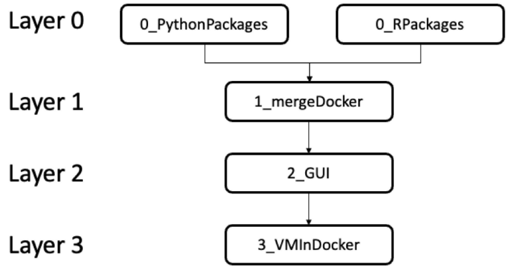
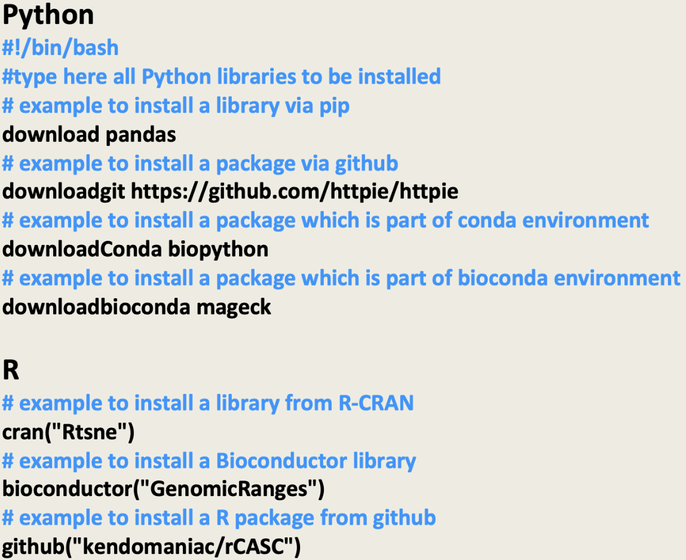
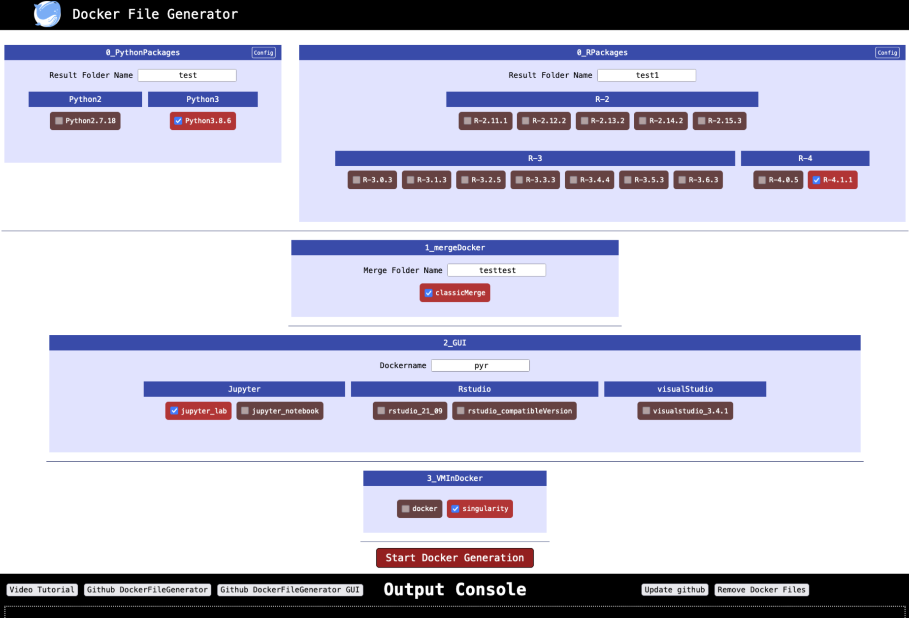

# Abstract

Containerization is a way of wrapping software, OS libraries and dependencies required to create an application that can be consistently run using different computing environments. Among the containerization frameworks proposed in literature Docker and Singularity are those most widely used for Unix-like OS. Docker engine opened the way to reproducibility in the bioinformatics arena. Indeed, nowadays, Docker containerization is extensively used to facilitate the distribution of bioinformatics workflows. However, the proper creation of Docker images can be still a complex task requiring advance competencies in computer science. CREDO, a friendly Customizable REproducible DOckerfile generator, was developed to make easy the creation of a docker image. Indeed, CREDO can create docker images including different software stacks as pip, conda, bioconda, github, R-CRAN and Bioconductor packages according to the user ‘s needs. CREDO simplifies a lot the way of building docker images embedding R and Python packages and it provides extra level of reproducibility since allowing to store in a github all the elements requied to build from scratch a docker image. CREDO also support a friendly GUI making this tool an optimal solution for the efficient and easy generation of docker images for life scientists.

# Introduction

Reproducibility is a critical problem in the Bioinformatics field [@uno]. Docker engine [2] is an optimal tool to deal with reproducibility issues [3]. Nowadays, R [4] and Python [5] are the most used programming approaches to create bioinformatics tools [6] and workflows [7-9]. Furthermore, environment managers like Conda [10] and Bioconda [11] make easy the coexistence of different Python computing environments and they are frequently used within the bioinformatics community. On the R side, Bioconductor [12, 13] provides the deployment of software, providing rigorous and reproducible analysis of data from biological assays. Together with Github [14], Bioconductor represents one of the most used ways to distribute tools for the bioinformatics community.
Conda and Bioconda, together with packages distributed using Bioconductor and GitHub, can be exploited for the creation of complex docker containers [1, 6]. Although very useful, the above tools have some critical points: i. Bioconductor provides only version control for Bioconductor packages, underling software, e.g. R-CRAN packages, are not version controlled. ii. GitHub packages do not provide version control for the software inherited by the GitHub package and GitHub links might be unstable, e.g. a GitHub package can be deleted, moved or renamed without providing a stable tracking of the application updates. iii. Conda and Bioconda environment setup in Docker containers might not be easy to handle by not-expert people [15, 16].
In general, the creation of a Dockerfile, the core element for the creation of a docker image, including heterogeneous packages and environments (e.g. Bioconductor, Conda, etc.), is the most critical point for the generation of a docker image, being at the same time complex and time consuming, especially for not experienced people. CREDO, Customizable REproducible DOckerfile generator, software fixes some of the issues and difficulties described above, since it provides an easy way to build and customize a Dockerfile. CREDO provides at the same time a reproducible infrastructure and an easy way to distribute complete computing analysis workflow, e.g. docker images created by CREDO are perfectly suited to facilitate the distribution of complex code to reviewers or providing ready to go vignettes and tutorials (see supplementary information file). 
CREDO is organized in two modules namely CREDOengine and CREDOgui.

# Results
## CREDOengine

CREDOengine allows the construction of Dockerfile/s embedding Python and/or R. The architecture of CREDOengine is organized in three layers, Fig.1.
Layer 0 provides the possibility to create a Docker image embedding Python (0_PythonPackages) or R (0_RPackages). Layer 1 (1_mergeDocker) allows user to merge a Python Dockerfile with a R Dockerfile, previously generated at Layer 0. Layer 2, it provides the possibility to select various programming graphical interfaces (Jupyter lab, Jupyter notebook, Rstudio and Visual Studio), which can be accessed, in the built docker container, via web application (http://localhost:8888). Layer 3 (3_VMInDocker) configures the virtual environment to execute docker or singularity instances within a docker container, Fig. 1. This specific feature is useful in case the running docker container, requires executing the software embedded in another docker or in a singularity instance.

<em>Fig. 1. Structure of CREDOengine. For the generation of a Dockerfile at least one of the two modules in layer 0 must be used. Layer 1 is not mandatory, but, if used, it requires the presence of both Python and R modules defined in layer 0. Layer 2 is not compulsory, but it requires at least one module from layer 0 to be executed. Layer 3 is not compulsory, but it requires at least one module from layer 0.</em> 

Furthermore, CREDOengine provides a simplified interface to install Conda/Bioconda, Bioconductor and GitHub packages, Fig. 2.

<em>Fig. 2. Config file example for packages selection.</em> 

Dockerfile represents an easy approach to distribute in a compact way all the information required to build a docker image, e.g. BioContainers community [17] distributes docker applications by mean of their Dockerfile. However, as indicated above, some reproducibility criticalities can be still present simply using a Dockerfile to distribute a docker based application. CREDO fixes some of the above-mentioned issues, which can be associated with the development of a docker image using a Dockerfile, e.g. the lack of version control in the dependencies required for the installation of a specific R-package. CREDOengine performs an initial installation, in a temporary docker container, of the libraries specified in a config file, Fig. 2. Then, all information about the dependencies tree is saved and all dependency packages are downloaded and split into files which are size compatible to the upload in a GitHub repository, i.e. max 25 MB/each. The temporary docker, used to download and detect the dependencies, is then deleted and a new Dockerfile is generated using the full list of packages previously downloaded. CREDOengine creates a folder that contains all the files required to perform a docker build from scratch, without any new download, removing the risk of broken links, packages changed names and uncontrolled library version changes.
Then Python and R are compiled from their source code. The docker build can be done by executing the script.sh/cmd file, which is present in the folder generated by CREDOengine.
This folder contains all the elements required to build the Docker image that was defined, and it can be directly loaded into a GitHub repository, for distribution or further docker refinement.
Once the docker image is built, the script.sh/script.cmd can be moved into the folder expected to be mounted as the shared folder on the docker container. Inside the Docker container, the shared folder is located in /sharedFolder, but such location can be easily changed, modifying the script.sh/cmd .
All code generated during the Dockerfile creation is placed into an independent folder. In each layer folder there is a script.sh/script.cmd, which builds and runs the Docker image layer. For layer 0 and layer 1, after running the script.sh/script.cmd the user is redirected inside the Docker instance with a /bin/bash command. For layer 2, where a programming GUI is integrated, and layer 3, after executing the script.sh/script.cmd, the running container is accessible via a web application (http://localhost:8888).
## How to modify CREDOengine
The rules to add/modify layers or add/modify software versions are few and simple. As first, a new branch of CREDOengine must be created. Each layer is indicated with the format “number_”, such that all folders referring to layer 0 will start with “0_”. In each folder, the script running the docker generation must be called runMe.sh. This script runs a dummy container and downloads and installs all the required packages. Those packages are stored in a shared folder connecting the physical host and the dummy docker container. The Dockerfile, generated with the above information, uses the downloaded files for docker building. In 0_RPackages folder of CREDOengine is present a skeleton file, providing an example of how to add layers for new programming languages or to add new R or python versions. To provide the input for runMe.sh script, each layer also needs a file named inputconfig.txt, which has the following structure:

Temp Docker:H+R
Result Folder Name:U+empty
sharedpath:H+/sharedFolder/
configpath:H+/sharedFolder/configurationFile.txt

Each line of this file represents an input parameter passed to the runMe.sh script. For each parameter, it is necessary to specify the parameter name and its characteristics using the following structure:

    • H: the parameter is not shown in CREDOgui 
    • R: the parameter is assigned randomly from a list of names (see the /nodejs/support/inizialize.js file)
    • U: the parameter appears as a box on CREDOgui 
    • empty: the parameter box will be empty 

If the parameter is not random or empty you can add new values using the “+” sign.
CREDOengine container is running a docker in docker, where the shared folder of the physical host and the shared folder of CREDOengine must have the same name, but different paths. The configurationFile.txt contains the hostPath, where the results of the CREDOengine will be stored.
## CREDOgui
CREDOgui facilitates the configuration of the various layers of the CREDOengine, Fig. 3.

<em>Fig.3. Screenshot of the CREDOgui. In the CREDOgui the dependencies among the different layers are more stringent, specifically any layer depends on the previous one</em> 

CREDOgui can be accessed via web application (http://localhost:3000), executing on a computer dockerFileGenerator.sh (for Linux/OSX users) or dockerFileGenerator.cmd (for Windows users) script, which is available at CREDOgui GitHub. For Python and R in layer 0 the libraries to be installed can be defined using the button “Config”. In layer 1, the user must define the name of the folder in which the merged Dockerfiles will be stored. In layer 2, the user must define the final name of the Docker image and select the GUI of interest. In case of a programming GUI is selected, the final name of the folder, where the Dockerfile is saved, also includes the name of the available GUI. After building and running the docker container the embedded GUI will be accessible via web application (http://localhost:8888), In layer 3, it is possible to install a Docker or a Singularity instance in the built Docker image.
In CREDOgui, each layer requires the previous one, meaning that layer 3 cannot be selected without layers 0 and 1 and 2. On the other side, each layer is independent from the next layer, that means that a user can build a docker with layer 0 and layer 1, without selecting layers 2 and/or 3. Once the Config files are edited and the settings are completed the construction of the Dockerfile can begin pressing “Start Docker Generation”. The output console provides a short summary of the on-going steps. A complete detailed description of the on-going steps is available in the log file saved in the folder where the dockerFileGeneration.sh (in Linux and MacOS) or dockerFileGeneration.cmd (in Windows) script is executed. 
To futher improve the usability of CREDOgui we provide a video tutorial showing how to use the GUI, the Youtube link to the tutorial is accessible as part to the CREDOgui, Fig. 3. Furthermore, CREDOgui contains two other buttons to access the GitHub page of the CREDOengine, and CREDOgui. There is also a button to download the latest version of the CREDOgui (update github) and a button (Remove DockerFiles) removing the temporary layers generated during the creation of the final Dockerfile.
## Accessing to Conda/Bioconda environments 
Conda Environment are stored into /snowflakes/condaName folder of the docker container and can be activated with the following code:
source /snowflakes/condapackageName/bin/activate
Bioconda environment is stored into /snowflakes/biocondaName folder of the docker container and to activate it is enough to run the following code:
source /snowflakes/biocondapackageName/bin/activate
## Accessing to programming environment GUI
The programming environment GUIs, which can be added to the Docker image, are: i. Jupyter (Lab or notebook), ii. Rstudio. Only one of these programming environment GUIs can be added to the final Docker image.
## Availability and requirements 
Project home page: https://github.com/alessandriLuca/CREDOengine; https://github.com/alessandriLuca/CREDOgui 
Operating system(s): Linux, MAC OSX, Windows 10/11
Programming language: R, Python, Bash
Other requirements: Docker desktop 
License: GNU GPL

# Conclusions
The strength of the CREDO is the possibility to store, in a github compatible format, all the packages indicated in the Dockerfile, together with their dependencies. This characteristic improves the reproducibility, since, in case the docker image must be built from scratch, all the information needed are available on github. Furthermore, the availability of a friendly GUI, linked to the ability of CREDO of generating modular Docker Images, makes this tool an optimal solution for the efficient generation of docker images for life scientists.

# References
